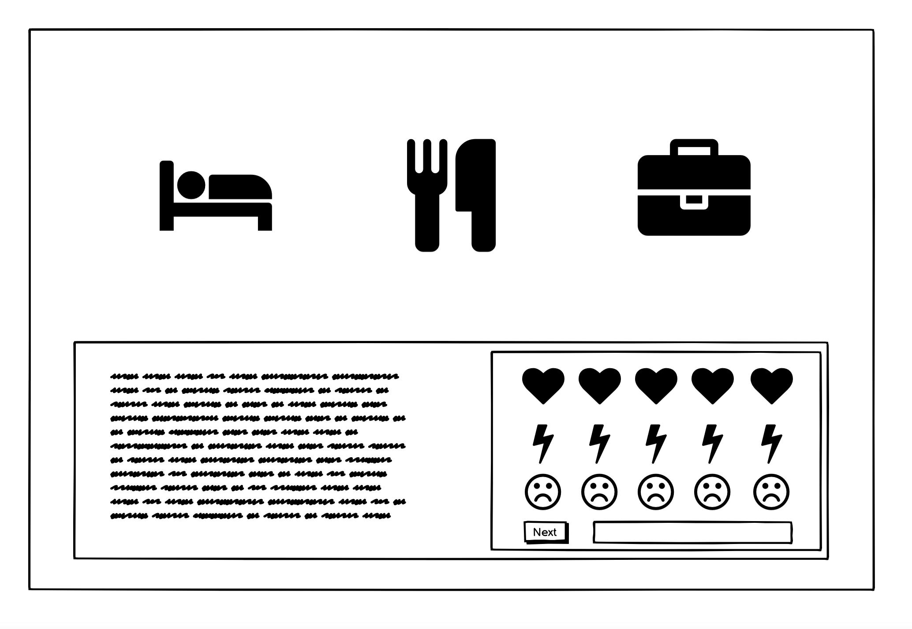
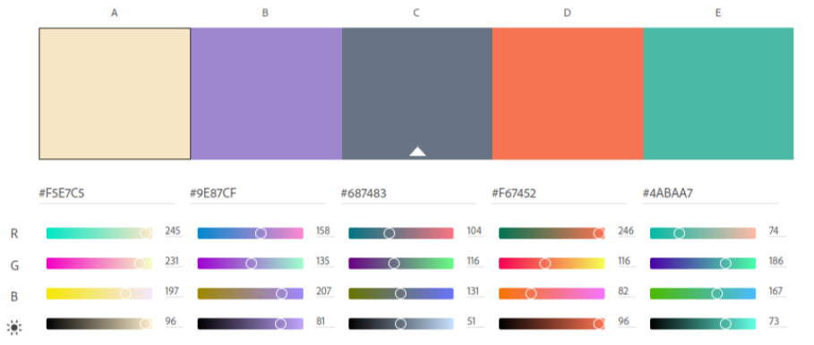

# The Never Ending Coding Adventure: Codehog Day

This project was built for the 2021 Retro Gaming Hackathon of Code Institute.
The purpose of the project was to build a retro-styled game based on the earliest developed computer games, as well as growing as (aspirin]g) developers by working together as a team and manage version control of the to-be developed product.

The live link can be found here - [The Never Ending Coding Adventure: Codehog Day](https://andrewdempsey2018.github.io/The-Never-Ending-Coding-Adventure-Codehog-Day/)

---

 TO BE ADDED

---

## Table of content

- [User experience](#user-experience)
  - [User stories](#user-stories)
- [Design](#design)
  - [Wireframes](#wireframes)
  - [Colour scheme](#color-scheme)
  - [Typography](#typography)
  - [Imagery](#imagery)
- [Features](#features)
  - [Existing features](#existing-features)
  - [Future features](#future-features)
- [Technologies](#technologies)
    - [Languages](#languages)
    - [Version control- workspace and repository storage](#version-control--workspace-and-repository-storage)
- [Testing](#testing)
- [Deployment](#deployment)
    - [Deployment to Github](#deployment-to-github)
    - [Run code locally](#run-code-locally)
      - [Forking local repository](#forking-local-repository)
      - [Cloning local repository](#cloning-local-repository)
- [Credits](#credits)
  - [Code snippets](#code-snippets)
- [Team](#team)

---

## User experience

### User stories

- As a user I want the game to have a simple interface.
- As a user I want to be able to know how the game works intuitively.
- As a user I want the game instructions to be easy.
- As a user I want have fun playing the game.
- As a user I want to game to have a retro feel, and not take itself too seriously.

[Back to Table of content](#table-of-content)

---

### Design

#### Wireframes

[Back to Table of content](#table-of-content)

---

#### Colour Scheme

The colours used for this project are:
- #F5E7C5 - Dutch White
- #9E87CF - Lavender Floral
- #687483 - Slate Gray
- #F67452 - Outrageous Orange
- #4ABAA7 - Keppel
All of these colours were used throughout the project to create an authentic retro feel to the game.

[Back to Table of content](#table-of-content)

---

#### Typography

For this project we used the "Press Start 2P" (designed by CodeMan38) as a font.
This is a pixellated font and it brings out the retro feel of the early era of gaming.

[Back to Table of content](#table-of-content)

---

#### Imagery

The following images in the game was taken from the linked open source below.

- [Sleeping gif](https://wifflegif.com/gifs/136337-pixel-art-sleeping-gif)
- [Pong Poster](https://live.staticflickr.com/3320/3669852343_2c2929e121_b.jpg)
- [Breakout Poster](https://i.ebayimg.com/images/g/NEQAAOSw0YBgAKva/s-l300.jpg)
- [Flappy Bird Poster](https://i.kym-cdn.com/photos/images/original/000/697/154/ada)
- [Bedroom](https://www.vecteezy.com/vector-art/157529-free-simple-bedroom-illustration)
- [Macintosh](https://icon-icons.com/icon/macintosh/131159)

=========== TO REPLACE OTHERS???

NEW PONG      https://uploads.sitepoint.com/wp-content/uploads/2016/01/1452785857main.png
NEW BREAKOUT  https://img.itch.zone/aW1nLzY2MDg1MDUucG5n/original/OVVq9f.png
ALT FLAPPY    https://toppng.com/uploads/preview/flappy-bird-pixel-art-flappy-bird-1156289438531sspmvwnk.png
MARIO         https://p.kindpng.com/picc/s/255-2557213_black-and-white-mario-blue-slime-pixel-art.png
ASTEROIDS     https://i.pinimg.com/originals/e8/0f/16/e80f160b42833782d3bb931d5d5bdd3b.jpg

[Back to Table of content](#table-of-content)

---

## Features

### Existing features

### Future features

[Back to Table of content](#table-of-content)

---

## Technologies

  ### Languages

- [HTML](https://developer.mozilla.org/en-US/docs/Glossary/HTML5) 

- [CSS](https://developer.mozilla.org/en-US/docs/Web/CSS) 

- [Javascript](https://developer.mozilla.org/en-US/docs/Web/JavaScript)

[Back to Table of content](#table-of-content)

---

  ### Version control- workspace and repository storage

- [Git](https://git-scm.com/) - Version control software used to commit and push code to the GitHub repository where the source code is stored.
- [Gitpod](https://www.gitpod.io/) - Main workspace IDE (Integrated Development Environment).
- [GitHub](https://github.com/) - Used to host the deployed website and repository of all previous versions of 

--- 

### Other technologies

- [Adobe color](https://color.adobe.com/create/color-wheel) - Used to make the color palette.
- [Am I Responsive](http://ami.responsivedesign.is/) - Used to create the mockup.
- [Balsamiq](https://balsamiq.com/) Used to create the wireframes for this project.
- [Google Developer Tools](https://developer.chrome.com/docs/devtools/) - Used throughout the project for debugging.
- [Google fonts](https://fonts.google.com/) - Used to find the fonts.
- [Phaser js](https://phaser.io/) - Used as a game-engine.
- [Pinetools] (https://pinetools.com/pixelate-effect-image) - Used to pixelate images.

## Testing

=========== SEPERATE .MD FILE????

### Validator Testing 

- HTML
  - No errors were returned when passing through the official  [W3C validator](https://validator.w3.org/)
- CSS
  - No errors were found when passing through the official [(Jigsaw) validator](https://jigsaw.w3.org/css-validator/)
- Javascript
  - No errors were found when passing through the official [JSHint validator](https://jshint.com/)

### Bugs we fixed

### Unfixed Bugs

[Back to Table of content](#table-of-content)

---

## Deployment

### Deployment to Github

 Deploying to GitHub Pages:
 
- Sign in to GitHub.
- Insert the name of the repository in the search bar: [The-Never-Ending-Coding-Adventure-Codehog-Day](https://github.com/andrewdempsey2018/The-Never-Ending-Coding-Adventure-Codehog-Day) .
- Click on the repository to view more details.
- Click on settings, which is located in the row above the green Gitpod button.
- Scroll down to the GitHub Pages section.
- Under source, select master in the dropdown menu.
- Select /(root) in the tab which is right next to branch.
- Click Save (page will automatically refresh).
- Scroll down again to the GitHub pages section.
- A container with a blue blackground will tell you: "Your site is ready to be published at https://andrewdempsey2018.github.io/The-Never-Ending-Coding-Adventure-Codehog-Day/ .

[Back to Table of content](#table-of-content)

---

### Run code locally

You can either fork or clone the local repository on GitHub as follows.

  #### Forking local repository

You could make a copy of the GitHub repository by "Forking" the original repository onto your own account by following these steps:

  - Sign in to GitHub.
  - On GitHub, navigate to the[The-Never-Ending-Coding-Adventure-Codehog-Day](https://github.com/andrewdempsey2018/The-Never-Ending-Coding-Adventure-Codehog-Day) repository.
  - In the top-right corner of the page, click Fork.
  - You should now have a copy of this repository into your GitHub account.

  [Back to Table of content](#table-of-content)

  ---

  #### Cloning local repository

 You could make a clone of the GitHub repository by "Cloning" the original repository by following these steps:

  - Sign in to GitHub.
  - On GitHub, navigate to the [The-Never-Ending-Coding-Adventure-Codehog-Day](https://github.com/andrewdempsey2018/The-Never-Ending-Coding-Adventure-Codehog-Day) repository.
  - Above the repository folder and file content, click “Code”.
  - Select from one of the following options:
    - Clone the files using the url.
      - Copy the url.
      - Create a repository in GitHub and a workspace in your IDE.
      - Open the terminal and type: $ git clone https://github.com/andrewdempsey2018/The-Never-Ending-Coding-Adventure-Codehog-Day.git .
      - All the files should have been imported in your workspace.
    - Download zip files.
      - Create a repository in GitHub and a workspace in your IDE.
      - Unzip the folder.
      - Upload the files into your workspace.

[Back to Table of content](#table-of-content)

---

## Credits

### Code snippets

- [Text Box - Final Fantasy 7 Style Dialouge box](https://codepen.io/terrancerobb/pen/bnuqe)

[Back to Table of content](#table-of-content)

---

## Team

### - [Andrew Dempsey](https://github.com/andrewdempsey2018)
  -

### - [Helena Johansson](https://github.com/Odden69)
  - I am probably the person in this team with the least gaming experience. But I am the oldest, hence the most retro. Joining this hackathon has been so rewarding. I have learned so much from my fabulous fellow team mates.

### - [John Doyle](https://github.com/Aramantos)
  - Gaming has always been a passion of mine so this hackathon was a must. A retro game will make a proud addition to the portfolio and it was a great experience shaping it with the team. Hope you all enjoy it.

### - [Katherine Biggs](https://github.com/Kat632)
  - I've been gaming since I was about 8. I had an Acorn Electron. These days I'm a Simmer. The fastest thing I can type is "testingcheatsenabled true". This is a Sims joke that probably no one will understand.

### - [Patrik Österljung](https://github.com/oljung)
  - Ever since I played the NES at my uncles when I was five, gaming has been a huge part of my life. When I saw this Hackathon, I had to join even though I knew nothing about what it mean. Now that I know, that it means working with a team to make a project take form, I can safely say this will not be my last. This has been awesome! Thank you guys and please enjoy the game!
  -

### - [Yorick van den Hurk](https://github.com/nowane)
  - I've always had a lot of fun gaming when I was a kid. Seeing this theme for a hackathon come by was the last push I needed to engage more in the Code Institute community. Luckily I landed in an awesome team of truely awesome characters, with who I've been glad to had the pleasure working with.

#### - Special thanks go out to our facilitator mairead.ci

[Back to Table of content](#table-of-content)